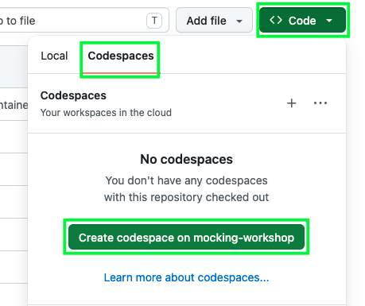

# Mocking Demystified: How to make your unit tests stronger with mocks

## About this repo

In this repository you will find a minimal web application built with FastAPI and the [Vonage Verify API](https://vonage.dev/4nYXkCu). Users can request a OTP password code sent to their email address. Upon entering the correct code into the app, users are rewarded with an animated gif.

This repository also serves as part of a workshop on using mocks in unit tests for better testing.

## Features

- **OTP Code Generation**: Generate a OTP code
- **OTP Code Email Delivery**: Use email to receive a OTP code
- **Verification**: Verify that the code provided by the user matches the code generated by Vonage
- **Unit tests with mock examples**: The unit tests use mocks of the Verify API for testing

## Built with

* [FastAPI](https://fastapi.tiangolo.com/)
* [Vonage Verify](https://vonage.dev/4nYXkCu)

# Getting Started

## Prerequisites
- Python 3.8+
- A [Vonage API account](https://vonage.dev/4dtSoCc)
- A [GitHub account](https://github.com/) (if you want to run this code in Codespaces)

## Creating a Vonage Verify application

### What is Vonage?

Vonage is a cloud-based communications platform that gives you the tools to embed communication capabilities directly into your own applications and services​.

Rather than building communication infrastructure from scratch, you can use Vonage APIs to add voice, video, messaging, verification, and other network-level capabilities to products​.

To run the code in this repo, you need a Vonage developer account and a Verify application.

### 1. Create a Vonage account

You will need a [Vonage API account](https://vonage.dev/4dtSoCc) -- it's free to sign up!

### 2. Create a Verify application

Create your Verify application in the [developer dashboard](https://dashboard.vonage.com/applications) by navigating to the **Applications** window from the left hand menu and clicking the “Create new application” button. This will open the application creation menu. Give your application a human-friendly name like `vonage-hello-world`.

Under the **Capabilities** section, toggle the option for **Verify**.

Click the “Generate new application” (or "Saves changes") button at the bottom of the application menu.


## Running the code

There are two ways you can run this code:
* [Locally on your machine](#running-the-code-locally)
* [On GitHub Codespaces](#running-the-code-on-github-codespaces)

The biggest difference between the two is how each method handles secrets.

### Obtaining your Vonage secrets

In the developer dashboard [Applications menu](https://dashboard.vonage.com/applications), click on your application and then click **Edit**. Once the edit window opens, click on the button that says, “Generate public and private key”. This will trigger a download of your private key as a file with the extension `.key`. **Keep this file private and do not share it anywhere it could be compromised.**

Click on the "Save changes button" and also note your Application ID.


In summary, these are the secrets you will need from Vonage in order for your app to work:

| Variable name           | Variable value                                                                              |
|-------------------------|---------------------------------------------------------------------------------------------|
| VONAGE_APPLICATION_ID   | This is the Vonage-generated ID of the Voice application you created for this sample code   |
| VONAGE_PRIVATE_KEY_PATH | This is the path to the **private.key** file you downloaded from the developer dashboard    |

## Running the code locally

### 1. Clone this repo

Clone this repo and change directories to the project directory:
```
git clone https://github.com/Vonage-Community/workshop-verify-python-mocks-example.git && cd workshop-verify-python-mocks-example
```
### 2. Set up your environment
Set up your environment by first creating and activating a [Python virtual environment](https://vonage.dev/42D6eeT):
```
virtuanlenv venv && source venv/bin/activate
```

Then install the project dependencies:
```
pip install -r requirements.txt
```

### 3. Configure your secrets as environment variables

Move your private key file to your project directory and configure the variables in the `.env_template` file accordingly:

```
VONAGE_APPLICATION_ID=your-application-id
VONAGE_PRIVATE_KEY_PATH=path-to-your-private-key-file
```

Then update the name of the file from `.env_template` to `.env`. You can learn more about handling environment variables in Python [here](https://vonage.dev/4wteA6n).

### 5. Run the app

To spin up the app, run the following from the project root directory:
```
fastapi dev
```

Now you can [try out the sample email verification app](#trying-out-the-email-verification-app).

## Running the code on GitHub Codespaces

[GitHub Codespaces](https://docs.github.com/en/codespaces/about-codespaces/what-are-codespaces) is a cloud-based online integrated development environment developed by GitHub.

### 1. Fork this repo

First fork this repo to your own GitHub account.

### 2. Configure your secrets for GitHub Codespaces

1. In the upper-right corner of any page on GitHub, click your profile picture, then click **Settings**
2. In the sidebar, under "Code, planning, and automation", select **Codespaces**
3. To the right of **Codespaces secrets**, click **New secret**
4. Under **Name**, type or copy and paste `VONAGE_APPLICATION_ID`
5. Under **Value**, copy and paste in the application ID you obtained earlier from the Vonage developer dashboard
6. Select the "Repository access" drop-down menu, then click on the name of this repository (`workshop-verify-python-mocks-example`)
7. Select **Add secret**
8. Repeat steps 4 - 7, this time with the **Name** `VONAGE_PRIVATE_KEY_PATH` and the **Value** copied and pasted from the contents of the `private.key` file downloaded from the Vonage developer dashboard

For more information on adding secrets to Codespaces, refer to the [GitHub documentation](https://docs.github.com/en/codespaces/managing-your-codespaces/managing-your-account-specific-secrets-for-github-codespaces#about-secrets-for-github-codespaces).

### 3. Create a codespace

From the forked repo in your GitHub account, click the green "Code" button and from the menu that appears, select the "Codespaces" tab. Then click the green "Create codespace" button.



This will open up a new browser tab and begin the creation of a new codespace. It will take a few moments to complete the process.

To learn more about creating a codespace, please refer to the [GitHub documentation](https://docs.github.com/en/codespaces/developing-in-a-codespace/creating-a-codespace-for-a-repository).

### 5. Run the app

To spin up the app, run the following in the codespace terminal:
```
fastapi dev
```

Now you can [try out the sample email verification app](#trying-out-the-email-verification-app).

# Trying Out the Email Verification App

Whether you are running the app locally or on GitHub Codespaces, in your browser, navigate to `http://127.0.0.1:8000`. You should see a webpage inviting you to "Try out the Vonage Verify
API by providing your email" with a text field for your email address.


You should be redirected to a page that asks you to provide the code sent to your email. Check your email for a OTP code from `verify[at]vonage.com` and enter this code.


If the code provided matches the code generated and sent by Vonage, then you'll be redirected to another page featuring an animated gif.

# Running the Tests

This repo also contains a suite of unit tests for the routes in `main.py` (`tests/test_main.py`). These tests use Python's `unittest` and builtin `mock` tools to simulate calls to the Vonage API.

Run the tests with the following command:

```
python -m unittest tests/test_main.py -v
```

# References

- [Python Environment Variables (Env Vars): A Primer](https://vonage.dev/4wteA6n)
- [A Comprehensive Guide on Working with Python Virtual Environments](https://vonage.dev/42D6eeT)
- [Vonage Verify API for Developers](https://vonage.dev/4nYXkCu)
